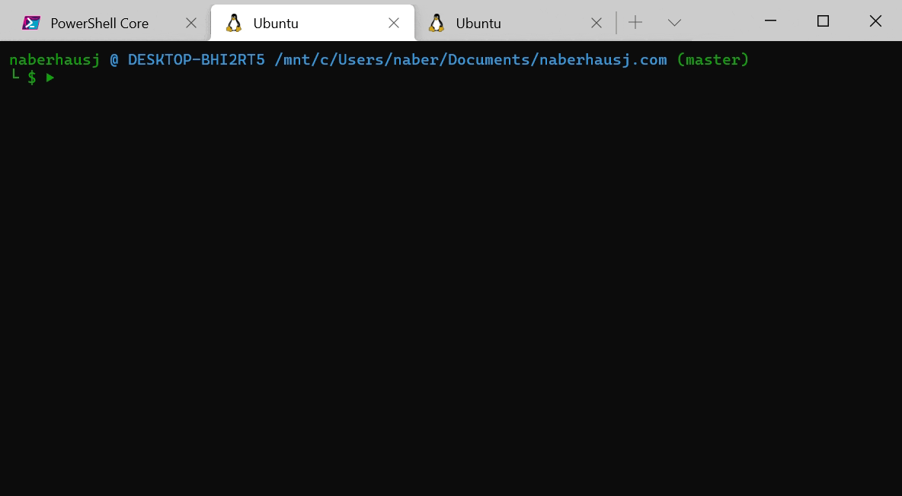

# Go-Mitizen
A Commitizen-like Git commit utility for written in Go. Used for standardizing commit messages.



## Compared to [cz-cli](https://github.com/commitizen/cz-cli)
- 👍 Starts significantly faster
- 👍 Doesn't require NPM
- 👍 Supports multiline bodies
- 👍 Configurable without NPM or JavaScript
- 👎 Not as configurable
- 👎 Isn't compatible with the full commitizen toolset

## Installation
#### From Binary
Download and extract the appropriate binary for your platform from the [releases page](https://github.com/JosephNaberhaus/go-mitizen/releases). Then run:

```
./go-mitizen --install
```

#### From Source
Download repository via Git or as a Zip. Then run

```
go build
./go-mitizen --install
```

## Usage
```html
git cz [--install] [--version] [--log] [--dry]
```
#### Flags
`--install`: Install the application to be runnable via `git cz`.

`--version`: Print the application's version

`--log`: Write log messages to the *logs.txt* file in the working directory for debugging.

`--dry`: Print the commit message without performing a commit (useful for debugging)

## Configuration
A configuration file will be looked for at `config.gz.json` in the root of the current repository. If this is not found then a global config will be looked for at `~/config.gz.json`.

The format of the config is simply:
```(json)
{
    "<property>": "<new value>",
    ...
}
```

Any property not specified with resort to its default.

#### Properties
##### *ForceSubjectLowerCase*
- **Type**: `boolean`
- **Default**: `true`
- **Description**: Convert all characters in the subject to lowercase.

##### *ForceScopeLowerCase*
- **Type**: `boolean`
- **Default**: `true`
- **Description**: Convert all characters in the scope to lowercase.

##### *AllowBlankLinesInBody*
- **Type**: `boolean`
- **Default**: `true`
- **Description**: Whether to remove any blank lines in the body of the commit (might be necessary for compatibility with other commitizen tools).

##### *MaxHeaderLength*
- **Type**: `int`
- **Default**: `100`
- **Description**: The number of characters allowed in the header of the commit. The utility will not allow the user to submit a header greater than this length.

##### *MaxLineLength*
- **Type**: `int`
- **Default**: `100`
- **Description**: The number of characters to allow in each line of the body and footer (length of header is set with *MaxHeaderLength*). Lines exceeding this length will be wrapped.

##### *Types*
- **Type**: Array of `{"name" : <string>, "description": <string>}` objects
- **Default**: [See code](https://github.com/JosephNaberhaus/go-mitizen/blob/master/commit/config.go)
- **Description**: The types of commits that can be made.

